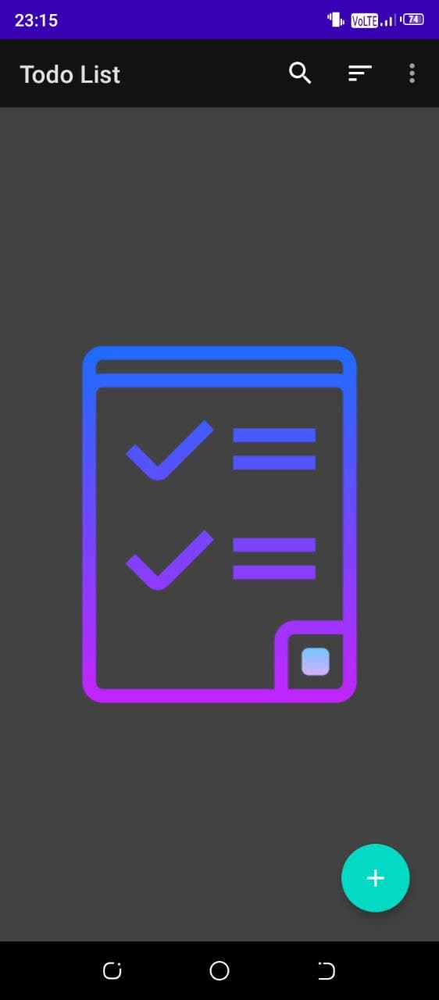
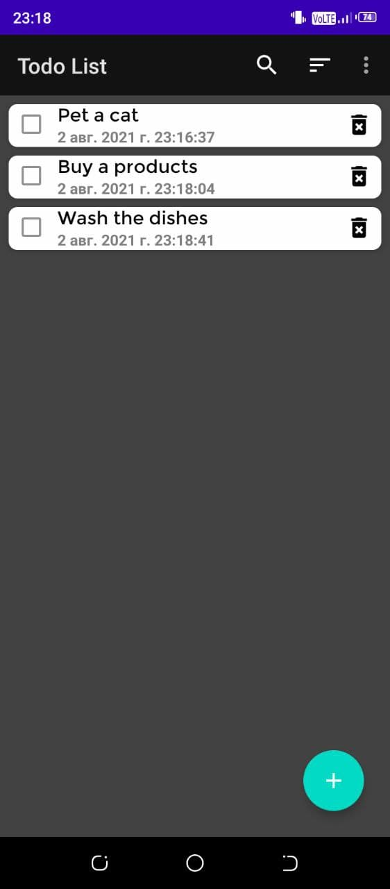
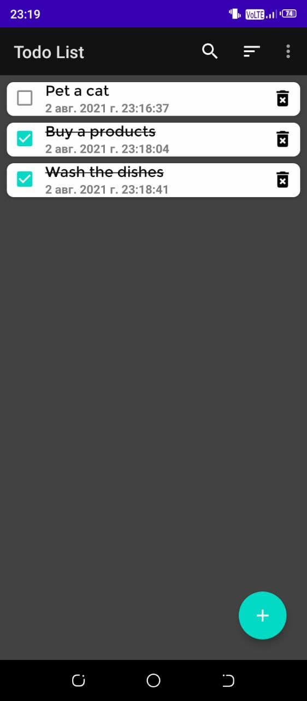
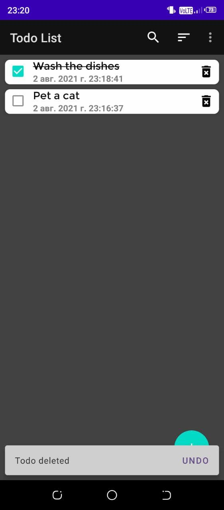

# __MVVM Todo List App__

This is a to-do list app that I developed as a home project for the Android operating system.
In this app, you can create todo, mark them as done, sort them, delete them, and so on.
The foundation of this app was created with two courses on creating a to-do list app, which you can find links to just below.

## __Links__
__[First course](https://www.youtube.com/playlist?list=PLrnPJCHvNZuCfAe7QK2BoMPkv2TGM_b0E)__

__[Second course](https://www.youtube.com/playlist?list=PLoCYbRS6dPkJMThvLiPEaWGQ0tV2XL4v8)__

## __Components__
* [Kotlin](https://developer.android.com/kotlin)
* [ViewModel](https://developer.android.com/topic/libraries/architecture/viewmodel)
* [LiveData](https://developer.android.com/topic/libraries/architecture/livedata)
* [Room](https://developer.android.com/jetpack/androidx/releases/room)
* [Kotlin Coroutines](https://developer.android.com/kotlin/coroutines)
* [Data binding](https://developer.android.com/topic/libraries/data-binding)
* [View Binding](https://developer.android.com/topic/libraries/view-binding)
* [Dagger Hilt](https://developer.android.com/training/dependency-injection/hilt-android)

## Installation

1. Clone this project in your project folder : `git clone https://github.com/Serokris/MVVM-Todo-List-App`
2. Open this project in Android Studio and do the following `Build Gradle Sync`